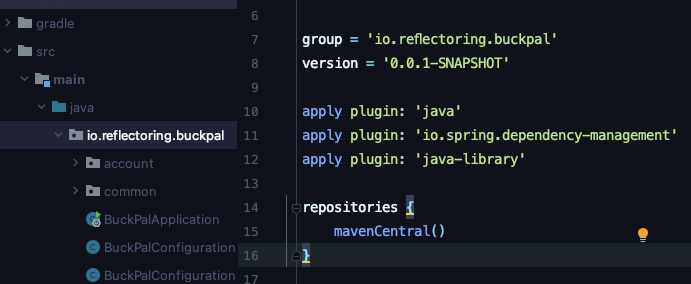

아키텍처 경계 강제하기
==

경계와 의존성
--
경계를 강제하다 : 의존성이 올바른 방향을 향하도록 강제하는 것을 의미함.

core - 도메인 엔티티 
애플리케이션 계층 - 애플리케이션 서비스안에 유스케이스를 구현하기 위해 도메인 엔티티로 접근 
어댑터 계층 - 인커밍 포트를 통해 서비스에 접근 / 서비스는 아웃고잉 포트를 통해 어댑터에 접근
설정 계층 - 어댑터와 서비스 객체를 생성할 팩터리를 포함 & 의존성 주입 매커니즘 제공

접근제한자
--
default(package-private) : 같은 패키지에 있는 다른 클래스까지만 허용. 
private : 해당 클래스에서만 접근허용. 같은 패키지라도 다른 클래스 또는 상속하는 곳에서도 접근이 불가능.

> 자바는 패키지를 통해 클래스들을 응집적인 '모듈'로 만들어 준다. 
> 이러한 모듈 내에 있는 클래스들은 서로 접근 가능하지만, 패키지 바깥에서는 접근할 수 없다.
> 모듈의 진입점으로 활용될 클래스들만 골라서 public으로 만들면 된다. 
> => 의존성 규칙을 위반할 위험이 줄어든다.

컴파일 후 체크
--
클래스에 public 제한자를 쓰면 아키텍처 상의 의존성 방향이 잘못되더라도 컴파일러는 다른 클래스들이 이 클래스를 사용하도록 허용한다. 
-> 의존성 규칙을 위반했는지 확인 할 수 없음. 

1. 컴파일 후 체크(post-compile check) 도입
- 코드가 컴파일 된 후에 런타임에 체크함. 
- ArchUnit이라는 도구가 있음. - 의존성 방향이 기대한 대로 잘 설정돼 있는지 체크할 수 있는 API를 제공함.
- 의존성 규칙 위반을 발견하면 예외를 던짐!
- 테스트를 통해 확인(테스트에서 실패)

빌드 아티팩트
--
빌드 도구의 주요한 기능 중 하나는 의존성 해결이다.

빌드 도구는 코드베이스가 의존하고 있는 모든 아티팩트가 사용 가능한지 확인하는 것. 

이를 활용해서 모듈 혹은 계층에 대해 전용 코드베이스와 빌드 아티팩트로 분리된 빌드 모듈(JAR 파일)을 만들 수 있다. 
각 모듈의 빌드 스크립트에서는 아키텍처에서 허용하는 의존성만 지정한다. 

각 모듈 별 빌드는 모듈 패키지당 build.gradle를 통해 만들 수 있다.

빌드 모듈로 아키텍처 경계 구분하는 방식이 패키지로 아키텍처 경계를 구분하는 방식과의 비교시 장점.
--

1. 빌드 도구는 순환 의존성을 극도로 싫어함. 
-> 빌드도구는 순환 의존성 자체를 허용하지 않기 때문.
2. 다른 모듈을 고려하지 않고 특정 모듈의 코드를 격리한 채로 변경할 수 있다.
-> 컴파일 에러 때문에 빌드자체가 실패함.
3. 모듈 간 의존성이 빌드 스크립트에 분명하게 선언돼 있기 때문에 새로 의존성을 추가하는 일은 우연이 아닌 의식적인 행동이 된다. 

> 컴파일 체크 도구의 도움을 받아보도록 하자!