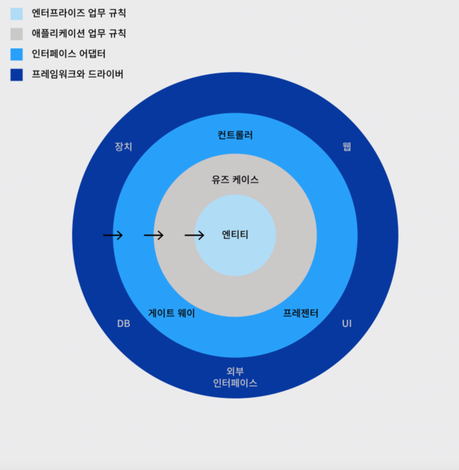
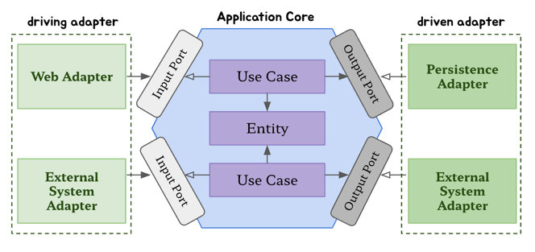

의존성 역전하기
==

SRP, DIP

SRP(단일 책임의 원칙) 
>하나의 컴포넌트는 오로지 한가지 일만 해야하고, 그것을 올바르게 수행해야 한다.

컴포넌트를 변경하는 이유는 오직 하나뿐이어야 한다! 가 더 올바른 의도.

책임 : 오로지 한가지 일만 하는것 (X) -> 변경할 이유(O)

변경할 이유가 한 가지라면 어떤 다른 이유로 소프트웨어를 변경하더라도 이 컴포넌트에 대해 신경 쓸 필요가 없음. 

시간이 갈 수록 컴포넌트를 변경할 더 많은 이유가 쌓여가고, 그 것이 다른 컴포넌트 까지 실패하는 원인으로 작용될 수 있다.

부수효과
--
특정 컴포넌트(핵심)를 변경 했을 때 다른 무언가가 망가지는 것. 

DIP(의존성 역전 원칙)
--
계층형 아키텍처에서의 의존성은 아래 방향을 가리킨다. 
-> 영속성 계층에 대한 도메인 계층의 의존성 때문에 영속성 계층을 변경할 때마다 잠재적으로 도메인 계층도 변경해야 한다.

DIP(의존성 역전 원칙)
> 코드 상의 어떤 의존성이든 그 방향을 바꿀 수(역전시킬 수)있다.

의존성의 양쪽코드를 제어 할 수 있을 때만 역전 시킬 수 있다. 서드파티 라이브러리에 의존성이 있다면 역전할 수 없다. 

영속성 코드가 도메인 코드에 의존 하고, 도메인 코드를 '변경할 이유'의 개수를 줄여보자.

클린 아키텍처
--
설계가 비즈니스 규칙의 테스트를 용이하게 하고, 비즈니스 규칙은 프레임워크, 데이터베이스, UI 기술, 외부 애플리케이션이나 인터페이스로부터 독립적일 수 있다. 
-> 도메인 코드가 바깥으로 향하는 어떤 의존성도 없어야 함.

  
참조 : https://meetup.nhncloud.com/posts/345

계층 간의 모든 의존성은 안쪽(core)으로 향해야함

core에는 도메인 엔티티가 있음. 
유스케이스는 서비스 
도메인 코드에서는 어떤 영속성 프레임워크나 UI프레임워크가 사용되는지 알 수 없음.  
-> 영속성이나 UI에 특화된 문제를 신경쓰지 않아도 됨. 

도메인 계층이 영속성이나 UI같은 외부 계층과 철저하게 분리되어야 하기 때문에 애플리케이션의 엔티티에 대한 모델을 각 계층에서 유지보수 해야함. 
-> ORM 사용시 엔티티 클래스를 사용해야 하기 때문에 도메인 계층의 엔티티와 서로 변환해서 데이터를 주고 받아야함. 
-> 결합 제거.

육각형 아키텍처
--
포트와 어댑터 아키텍처라고도 불림.

애플리케이션 코어가 각 어댑터와 상호작용하기 위해 특정 포트를 제공함. 

  
참조 : https://blog.jiniworld.me/176

왼쪽의 어댑터는 주도 어댑터, 오른쪽은 호출되는 주도되는 어댑터.

driving adapter는 포트가 코어에 있는 유스케이스 클래스에 의해 구현 및 호출 인터페이스. 
driven adapter는 포트가 어댑터에 의해 구현되고 코어에 의해 호출되는 인터페이스.

유지보수 가능한 소프트웨어
--
의존성을 역전시켜 도메인 코드가 다른 바깥족 코드에 의존하지 않게 함으로써 
영속성과 UI에 특화된 모든 문제로부터 도메인 로직의 결합을 제거하고 코드를 변경할 이유의 수를 줄이는 것.

